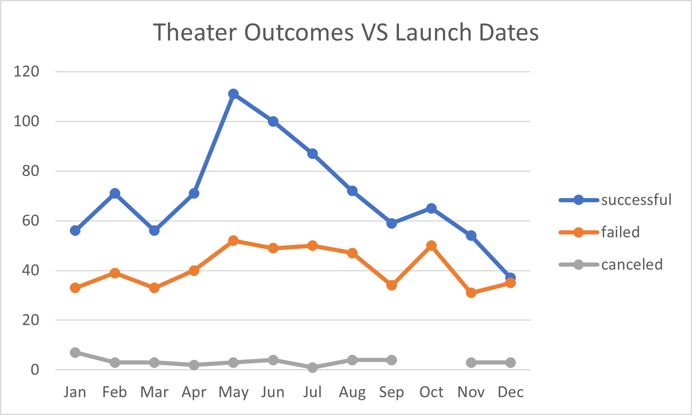
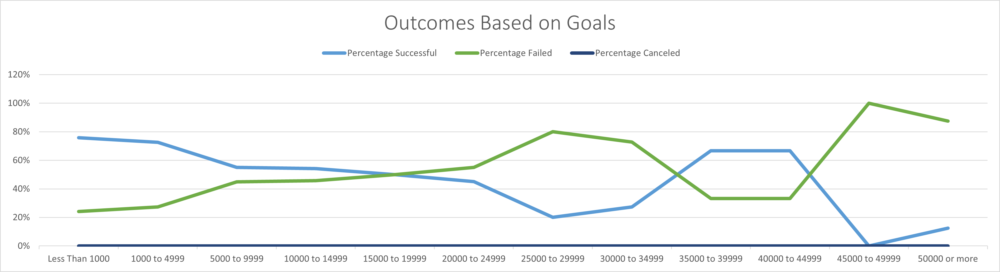

# **Kickstarting with Excel**

## Overview of Project
Statistical anaylisis of kickstarter campaigns, that analyzed the aspects of a sucessful theater based project based on launch dates of the kickstarter campaign.  
### Purpose
To assist the client in making the most judicial desicions regarding their project using the available data. 
## Analysis and Challenges

### Analysis of Outcomes Based on Launch Date
The analysis of outcomes based on launch date is divided into three catagories (successful, failed and canceled) campaigns. Using the Kickstarter challenge excel data, the Unix timestamp was converted into a readable date with day, month and year. The data was than filtered to show only theater campaigns and a pivot table was created to give a visual representation of the data.  

### Analysis of Outcomes Based on Goals
The analysis of outcomes based on goals is divided into the same three catagories. Using the Kickstarted challenge excell data a table was created dividing the goal data further dollar amount into ranges. The COUNTIFS() formula was used to calculate the number and than the percentage of in each range. This analysis yeild the visual representation of the goal vs the outcome of the campaign. 

### Challenges and Difficulties Encountered
- The principle challenge that was encountered when analyzing this data was creating the outcome based on goals. This formula was a bit complitcated to work out all the aspects. 
- I also was traveling during the intial work on this project and was using a small laptop. This made the large tables challenging to see and read. 

## Results

- You can conclude that it is more successful to launch a theater campaign in the month of May or June, which had the highest percentages of sucessful campaingns. It would be advised not to launch a campaign in the month of October or December, as these are the month with the least amount successful campaigns. 

- You can conclude that campaigns with goals of less than $5000 are more sucessful. Campaigns that have goals of less than $1,000 have a 76% success rate. Campaigns that have between $1,000 - $5,000 have a 73%.  Interestingly campaigns that have between $35,00-45,000 have a 67%. The success rate drops steeply both at the $5000- 35, 000 range and again on projects over $45,000. Therefor there tends to be two main catagories with more success, depending on the scope of your project which would be vital to choosing a campaign goal. 

- There are several limitations would require further research in order to imporve the successful outcome of this kickstarter campaign. The first limitation of this dataset, is we do not know who the donors were to the sucessful campaigns. There could be many factors that contribute to the number of donors, quanity of donation and success a play recieves. We are also limited in our knowledge of location by only contries, this leaves out the potential for regional nuances.  

- Further analysis can be done, by looking at the trands of outcomes based on goals and dates. Combining these datasets would help us more clearly see if the goal and date amount effected the success of a campaign.  Also, it would be useful to examine more closely the campaign goals and success rate. A graph showing the number of backers, amount donated and goal and launch date could clarify the campaign goals to sucess information. 
